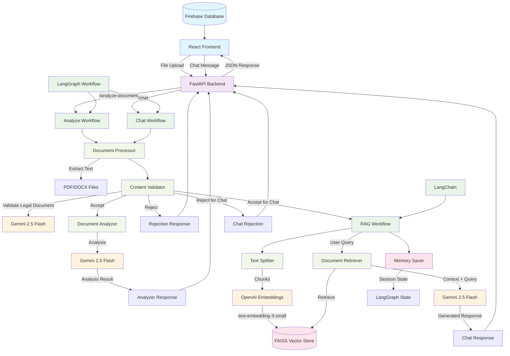

# Project Architecture Flow Diagram

## Complete System Architecture

## Detailed Flow Description

### 1. **Frontend Layer (React + Firebase)**
- React frontend handles file uploads and user interactions
- Firebase database stores application data
- Communicates with FastAPI backend via REST APIs

### 2. **API Layer (FastAPI)**
- **Main Endpoints:**
  - `/analyze-document` - Document analysis workflow
  - `/chat` - Conversational chat with documents
- **CORS Configuration** for frontend communication
- **Error Handling** and response formatting

### 3. **Document Processing Pipeline**
- **Document Processor** extracts text from PDF/DOCX files
- **Content Validator** uses Gemini 2.5 Flash to determine if document is legal-related
- **Validation Decision Points:**
  - Accept → Continue to next stage
  - Reject → Return rejection response with reason

### 4. **Analyze Workflow (LangGraph)**
- **Sequential Processing:**
  1. Text Extraction
  2. Document Validation
  3. Document Analysis (if accepted)
  4. Response Generation
- **Document Analyzer** uses Gemini 2.5 Flash for comprehensive analysis
- **Structured Output:** Document type, summary, important clauses

### 5. **Chat Workflow (RAG + LangGraph)**
- **Document Processing:**
  1. Text extraction and validation
  2. Text chunking using RecursiveCharacterTextSplitter
  3. Embedding generation using OpenAI's text-embedding-3-small
  4. Vector storage in FAISS database
- **Chat Processing:**
  1. Query processing with document retrieval
  2. Context-aware response generation using Gemini 2.5 Flash
  3. Session management with LangGraph checkpointing

### 6. **AI Models & Tools**
- **Gemini 2.5 Flash** - Primary LLM for validation, analysis, and chat
- **OpenAI Embeddings** - Vector embeddings for document chunks
- **FAISS** - Vector database for similarity search
- **LangChain** - Framework for LLM applications
- **LangGraph** - Workflow orchestration and state management

### 7. **Key Features**
- **Conditional Routing** based on validation results
- **Session Management** for conversational continuity
- **Memory Persistence** using LangGraph's MemorySaver
- **Error Handling** at each workflow stage
- **Structured Responses** using Pydantic models

## Technology Stack Summary

| Component | Technology |
|-----------|------------|
| Frontend | React |
| Database | Firebase |
| Backend API | FastAPI |
| Workflow Engine | LangGraph |
| LLM Framework | LangChain |
| Primary LLM | Gemini 2.5 Flash |
| Embeddings | OpenAI text-embedding-3-small |
| Vector Store | FAISS |
| Document Processing | PDF/DOCX extraction |
| Session Management | LangGraph MemorySaver |